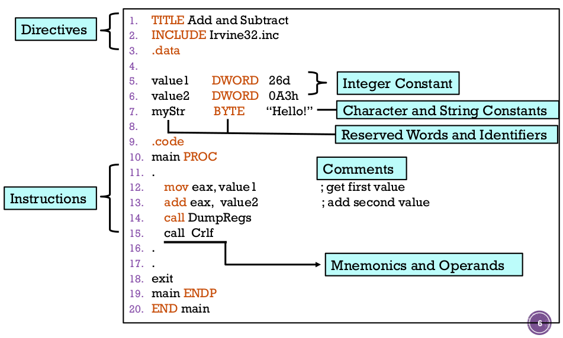
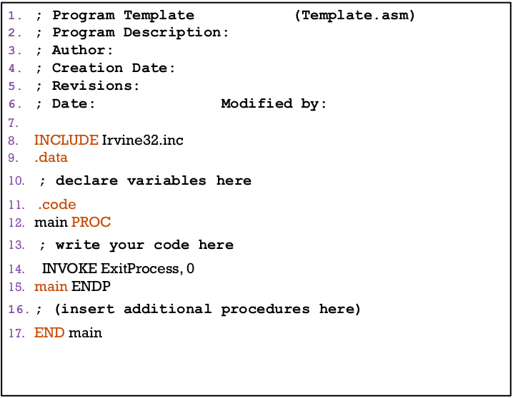

# CH3 Assembly Language Fundamentals

## Basic Elements of Assembly Language

### Add & substract

```nasm
TITLE Add and Subtract
INCLUDE Irvine32.inc
.data
    value1 DWORD 26d
    value2 DWORD 0A3h
    myStr  BYTE  "Hello!"

.code
main PROC
    mov    eax, value1
    add    eax, value2
    call   DumpRegs
    call   Crlf

exit
main ENDP
END main
```



### Directive

> Commands that are recognized and acted upon by the assembler
>
> + Not part of Intel instruction set
>
> + Used to declare code, data areas, select memory model, declare procedures, etc.
>
> + not case sensitive.
>
> **Example**
>
> > .data
> >
> > main PROC
> >
> > main ENDP
>
> Different assemblers have different directives. NASM not the same as MASM, for example.

### Integer constant

> Optional leading + or - sign
>
> binary, decimal, hexadecimal, or octal digits
>
> Common radix characters:
>
> h - haxadeciaml
>
> d - decimal
>
> b - binary
>
> r - encoded real
>
> 宣告16進位時若開頭為字母 ABCDEF 則需在開頭加 0
>
> **Precedence**
>
> | Operator | Name                  | Precedence Level |
> |:--------:|:---------------------:|:----------------:|
> | (  )     | parentheses           | 1                |
> | + , -    | unary(一元) plus, minus | 2                |
> | \* , /   | multiply, divide      | 3                |
> | MOD      | modulus               | 4                |
> | + , -    | add, subtract         | 5                |

### Character and string constant

> Enclose character in single or double quotes
>
> + 'A' , "x"
>
> Enclose strings in single or double quoutes
>
> + "ABC", 'xyz'

### Reserved words and identifiers

> Reserved words cannot be used as identifiers.
>
> **Identifiers**
>
> + 1-247 charcters, includeing digits
>
> + not case sensitive
>
> + first character must be a letter, \_, @, ? , or \$

### Instructions

> Assembled into machine code by assembly
>
> Executed at runtime by the CPU
>
> We use the Intel IA-32 instruction set
>
> An instruction contains:
>
> + Label..............................................(Optional)
>
> + Mnemonic(助記符).......................(Required)
>
> + Operand........(Depends on the instruction)
>
> + Comment......................................(Optional)
>
> #### Labels
>
> > + Act as place markers
> >
> > + **Follow indentifers rules**
> >
> > + Data label
> >   
> >   + must be unique
> >   
> >   + example: **myArray** (not followed by colon 冒號)
> >
> > + Code label
> >   
> >   + target or jump and loop instructions
> >   
> >   + example: **L1:** (followed by colon)
>
> #### Mnemonics and operands
>
> > + Instruction Mnemonics (助記符)
> >   
> >   + memory aid
> >   
> >   + examples: **MOV, ADD, SUB, MUL, INC, DEC**
> >
> > + Operands
> >   
> >   + constant
> >   
> >   + constant expression
> >   
> >   + register
> >   
> >   + memory (data label)
>
> #### Commentes
>
> > + Single-line comments: begin with semicolon(分號) ;
> >
> > + Multi-line comments: begin with COMMENT directive and a programmer-chosen character. End with the same programmer-chosen character
> >
> > ```nasm
> > COMMENT %
> > This line is comment.
> > This line is also a comment.
> > %
> > ```
> >
> > ```nasm
> > COMMENT !
> > This line is a comment.
> > This line is also a comment.
> > !
> > ```

### Program template



## Intrinsic(固有) Data Types

+ BYTE, SBYTE

  + 8-bit unsigned & signed integer

+ WORD, SWORD

  + 16-bit unsigned & signed integer

+ DWORD, SDWORD

  + 32-bit unsigned & signed integer

+ QWORD

  + 64-bit integer

+ TBYTE

  + 80-bit integer

+ REAL4

  + 32-bit IEEE short real

+ REAL8

  + 64-bit IEEE long real

+ REAL10

  + 80-bit IEEE extended real

### Defining byte and sbyte

```nasm
value1 BYTE  'A'
value2 BYTE  0        ;min
value3 BYTE  255      ;max
value4 SBYTE -128     ;min
value5 SBYTE +127     ;max
value6 BYTE  ?        ;unintialized byte
```

### Defining byte arrays

```nasm
list1 BYTE 10, 20, 30, 40
list2 BYTE 10, 20, 30, 40
      BYTE 50, 60, 70, 80
      BYTE 81, 82, 83, 84
list3 BYTE ?,  32, 41h, 0010010b
list4 BYTE 0Ah, 20h, 'A', 22h
```

### Defining strings

```nasm
str1 BYTE "Enter your name", 0 ; 0 視作 \0
str2 BYTE 'Error: halting program', 0
str3 BYTE 'Helo'
     BYTE 'World', 0

str4 BYTE 'Checking Account', 0dh, 0ah, 0dh, 0ah
     '1. Create a new account', 0dh, 0ah
     '2. Open an existing account', 0dh, 0ah
     '...', 0
;0dh, 0ah 視作 \r\n
```

### Using the DUP operator

> Use DUP to allocate (create space for) an array or string. Syntax: **counter DUP (argument)**

```nasm
var1 BYTE 20 DUP(0)
var2 BYTE 20 DUP(?)
var3 BYTE 4  DUP("stack"); 20 bytes "stackstackstackstack"
var4 BYTE 10, 3 DUP(0), 20; 5 bytes 10,0,0,0,20
```

### Defining word and sword data

```nasm
word1 WORD   65535        ;0 ~ 65535
word2 SWORD -32768        ;-32768 ~ 32767
word3 WORD  ?
word4 WORD  "AB"

myList WORD 1,2,3,4,5
array  WORD 5 DUP(?)
```

## Defining dword and sword data

```nasm
val1 DWORD  4294967295        ;0~4294967295
val2 SDWORD -2147483648       ;0~2147483647
val3 DWORD  20 DUP(?)
val4 SDWORD -3, -2, -1, 0, 1
```

### Defining qword, tbyte, real data

```nasm
quad1 QWORD 1234567812345678h; 64-bit 8-Byte
val1  TBYTE 123456789ABCDEF12345h; 80-bit 10-Byte

rval1 REAL4  -2.1
rval2 REAL8  3.2E-260
rval3 REAL10 4.6E+4096
ShortArray REAL4 20 DUP(0.0)
```

## Little Endian Order

> 在現今主流的 CPU 中，最常見的位元組順序有兩種，分別是 Big-Endian 與 Little-Endian，Big-Endian 是指資料放進記憶體中的時候，最高位的位元組會放在最低的記憶體位址上，而 Little-Endian 則是剛好相反，它會把最高位的位元組放在最高的記憶體位址上。
>
> All data types larget than a byte store their individual bytes in reverse order. The least significant byte occurs at the first (lowest) memory address.
>
> **Example**
>
> ```nasm
> val1 DWORD 12345678h
> ```
>
> DWORD 有 4 個 bytes 分在 4 塊記憶體 **(期中考出現)**
>
> | 位置  | 值  |
> |:----:|:---:|
> | 0000 | 78  |
> | 0001 | 56  |
> | 0002 | 34  |
> | 0003 | 12  |
>
