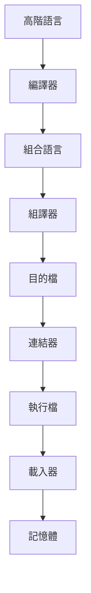

# CH1 System Software: An Introduction to Systems Programming

## 1-1 Introduction

### System software

> **Definition**
> 
> 1. Consist of a variety of programs that support the operation of a computer
> 
> 2. Make it possible for the user to focus on an application without needing to know the details of how the machine work internally
> 
> **For example**
> 
> 1. Text Editor
>    
>    create and modify the program
> 
> 2. Compiler
>    
>    thanslate programs into machine language
> 
> 3. Loader or Linker
>    
>    load machine language program into memory and prepared for execution
> 
> 4. Debugger
>    
>    help detect errors in the program
> 
> 5. Assembler
>    
>    translate assembly program into machine language
> 
> 6. Marco Processor
>    
>    translate macros instructions into definition

### Application Software

> Application softwares are primary concerned with the solution of some problem
> 
> **For example**
> 
> Excel, Word, Power Point, Chrome, Firefox, Photoshop, Line

## 1-2 System Software and Machine Archtecture

> One characteristic in which most system software differs from application software is **machine dependency**
> 
> + *System programs* are intended to support the operation and use of computer
> 
> + *Application programs* are primary concerned with the solution of some problem.
> 
> **Example**
> 
> + Assembler translates mnemonic(助記符) instructions into machine code.
> 
> + Complier must generate machine language code.
> 
> + OS is directly concerned with the management of nearly all of the resouces of a computing system

### Machine structures

> Important machine structures to design of system software
> 
> + Memory structure
> 
> + Registers
> 
> + Data fomats
> 
> + Instructions formats
> 
> + Addressing modes
> 
> + Instruction set
