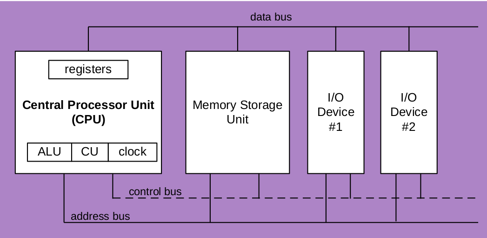
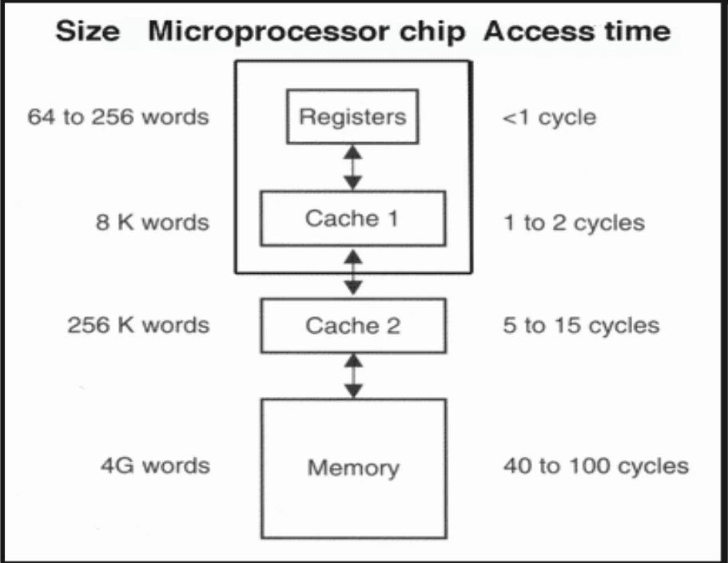
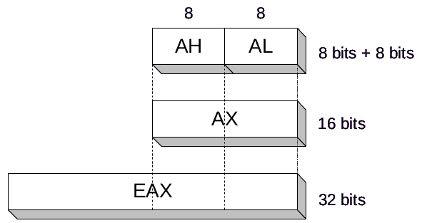
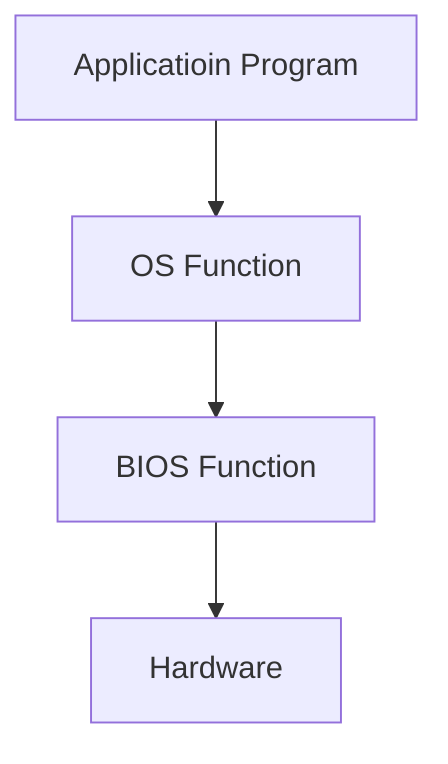

# CH2 X86 Processor Architecture

## General Concept

### Basic microcomputer design

> + **clock** synchronizes CPU operations
> 
> + **control unit (CU 控制單元)** coordinates sequence of execution steps
> 
> + **ALU** (Arithmetic Logic Unit, 算術邏輯單元) performs arithmetic and bitwise(位元) processing
> 
> 

### Clock

> + synchronizes all CPU and BUS operations
> 
> + machine (clock) cycle measures time of a single operation
> 
> + clock is used to trigger events

### Registers

> 1. CPU registers
> 
> 2. Cache
> 
> 3. RAM
> 
> 4. Hard Disk
> 
> 1 → 4 
> 
> Fastest, smallest, and most expensive → Slowest, Largest, and least expensive

### Memory hierarchy

> 

## IA-32 Processor Architecture

### Mode of operation

> + Protected mode
>   
>   native mode (本機模式) ex: Windows, Linux
> 
> + Real-address mode
>   
>   native MS-DOS
> 
> + System management mode
>   
>   power management, system security, diagnostics
> 
> + Virtual - 8086 mode
>   
>   + hybrid of Protected
>   
>   + each program has its own 8086 computer

### Basic execution environment

> **Protected mode**
> 
> + 4GB
> 
> + 32-bit address
> 
> **Real-address and Virtual-8086**
> 
> + 1MB space
> 
> + 20-bit address
> 
> **Registers**
> 
> Registers are high-speed storage locations directly inside the CPU
> 
> 32-bit General-Prupose Registors
> 
> > EAX, EBX, ECX, EDX
> > 
> > EBP, ESP, ESI, EDI
> 
> + EFLAGS
> 
> + EIP
> 
> 16-bit Segement Registers
> 
> > CS, SS, DS
> > 
> > ES, FS, GS
> 
> 
> 
> | 32-bit | 16-bit | 8-bit(high) | 8-bit(low) |
> |:------:|:------:|:-----------:|:----------:|
> | EAX    | AX     | AH          | AL         |
> | EBX    | BX     | BH          | BL         |
> | ECX    | CX     | CH          | CL         |
> | EDX    | DX     | DH          | DL         |
> 
> Some registers have only a 16-bit name for their lower half
> 
> | 32-bit | 16-bit |
> |:------:|:------:|
> | ESI    | SI     |
> | EDI    | DI     |
> | EBP    | BP     |
> | ESP    | SP     |

> ### Some Specialized Registers Uses
> 
> **EAX** : <u>e</u>xtended <u>a</u>ccumulator register
> 
> **ECX** : loop <u>c</u>ounter
> 
> **ESP** : stack pointer, <u>e</u>xtended <u>s</u>tack <u>p</u>ointer register
> 
> **ESI, EDI** : index registers. <u>E</u>xtended <u>s</u>ource/<u>d</u>estination <u>i</u>ndex registers
> 
> **EBP** : extended frame pointer(stack). Used by high-level languages to reference function parameters and local variables
> 
> **Segment register**: as base locations for preassigned memory areas
> 
> **CS** : code segment. Hold instruction
> 
> **DS** : data segment. Hold global variables
> 
> **SS** : stack segment. Hold local variables and function parameters
> 
> **ES, FS, GS** : additional segments
> 
> **EIP** : instruction pointers
> 
> **EFLAGS** : status and control flags. Each flag is a single binary bit.

## 64-bit Prossesors

> + 32-bit general purpose registers:
> 
> > EAX, EBX, ECX, EDX, EDI, ESI, EBP, ESP, R8D,
> > R9D, R10D, R11D, R12D, R13D, R14D, R15D
> 
> + 64-bit general purpose registers:
> 
> > RAX, RBX, RCX, RDX, RDI, RSI, RBP, RSP, R8, R9,
> > R10, R11, R12, R13, R14, R15

## Components of an IA-32 Microcomputer

## Input-Output System

> when a HLL program displays a string of characters, the follwing steps take place:

