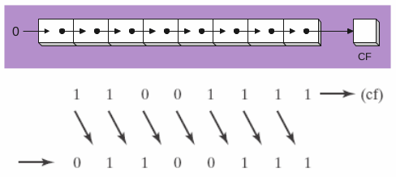
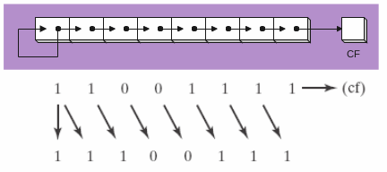

# CH7 Integer Arithmetic

## Shift and Rotate Instructions

### Logical shift

> A logical shift fills the newly created bit position with zero:
> 
> 

### Arithmetic shift

> An arithmetic shift fills the newly created bit position with a copy of the number's sign bit:
> 
> 

### SHL instruction

> The SHL (shift left) instruction performs a logical left shift on the destination operand, filling the lowest bit with 0.
> 
> ```nasm
> MOV DL, 5    ; 00000101
> SHL DL, 2    ; 00010100 = 20
> ```

### SAL & SAR instructions

> SAL (shift arithmetic left) is identical to SHL.
> SAR (right arithmetic right) performs a right arithmetic shift on the destinaion operand.
> 
> ```nasm
> MOV DL, -80
> SAR DL, 1    ; >>1 in C,  DL = -40
> SAR DL, 2    ; >>2 in C,  DL = -10
> ```

### Shift instruction

| instruction | intro                  |
|:-----------:|:----------------------:|
| SHL         | Shift Left             |
| SHR         | Shift Right            |
| SAL         | Shift Arithmetic Left  |
| SAR         | Shift Arithmetic Right |
